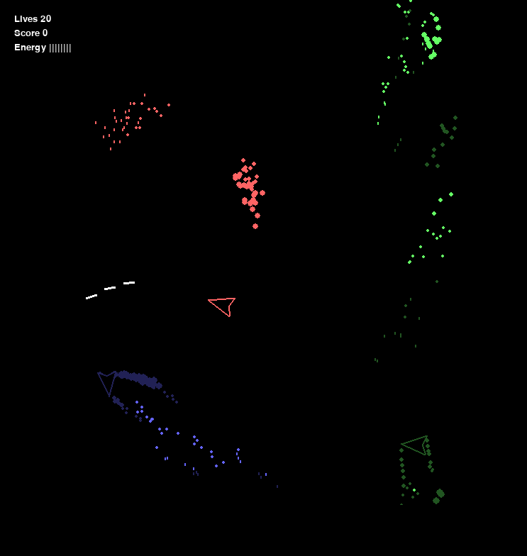

# Introduction

This is an asteroids game I made in 2012, around the time I started my first year in university.



The game is really just a prototype, but it does have the benefits of a smooth gameplay and physics based movement.

# Launching the Game

This game is written in Python 2 and requires `pygame`.

```bash
virtualenv venv
. venv/bin/activate
pip install pygame # (known to work with pygame==1.9.6)
python asteroids.py
```

Be aware that the game will launch directly into fullscreen mode.

# Playing the Game

There are three ships in the game: the red ship, controlled by the player and two other AI-controlled ships. The match is a free-for-all, each ship trying to shoot down ships, aiming for the largest score.

It's important to note that because the dynamics of the ships are similar to that of real ships in space (meaning that thrust controls momentum and there is no friction), the ships can pick up too much speed and become difficult to control. To counter this, the momenum dampeners may be used (with Ctrl and LShift).

# Keyboard Controls

| Button                | Outcome                                          |
|-----------------------|--------------------------------------------------|
| Esc                   | Quit the game                                    |
| Left & Right arrows   | Add clockwise/counter-clockwise angular momentum |
| Up arrow              | Add forwards momentum                            |
| Z key (hold pressed)  | Shoot                                            |
| Ctrl (hold pressed)   | Dampen translational momentum                    |
| LShift (hold pressed) | Dampen rotational momentum                       |
